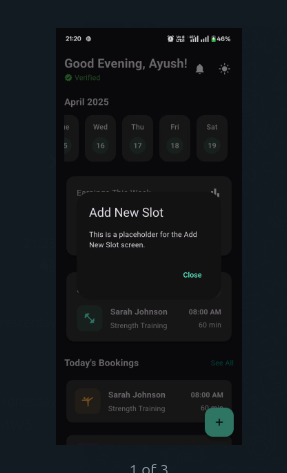
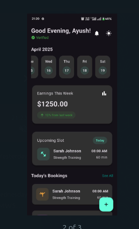
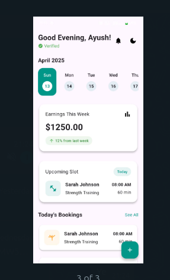

:

🏋️‍♂️ Trainer Dashboard App
A modern, responsive Flutter dashboard app for personal trainers to manage bookings, view weekly earnings, and monitor upcoming sessions. It features a dark/light theme toggle, calendar strip, and detailed booking information.

📱 Features
🌞🌚 Light & Dark Mode toggle

🗓️ Horizontal calendar date strip

💵 Weekly earnings card with percentage growth

📋 Next session details

📅 Today’s booking list

➕ Floating button to add new training slots (dialog placeholder)

🚀 Getting Started
Follow these steps to run the app on your local machine.

✅ Prerequisites
Ensure you have the following installed:

Flutter SDK

Dart SDK

Android Studio / VSCode with Flutter plugin

A connected device or emulator

🛠️ Installation Steps
bash
Copy
Edit
git clone https://github.com/yourusername/trainer_dashboard_app.git
cd trainer_dashboard_app
flutter pub get
flutter run
📸 Screenshots
1. Home Dashboard

2. Dark Mode

3. Calendar Strip

Project Structure (Highlights)
bash
Copy
Edit
lib/
├── main.dart             # Entry point with theme and routing
├── trainer_dashboard.dart # UI and logic of the dashboard
🧠 Built With
Flutter

Dart

intl for date formatting

💡 Future Improvements
Backend integration for real-time bookings

Add slot form with input validation

Push notifications

Login/Signup screen

🙌 Acknowledgements
Designed and built with ❤️ for the fitness community.

# fitnesstrainerapplication
